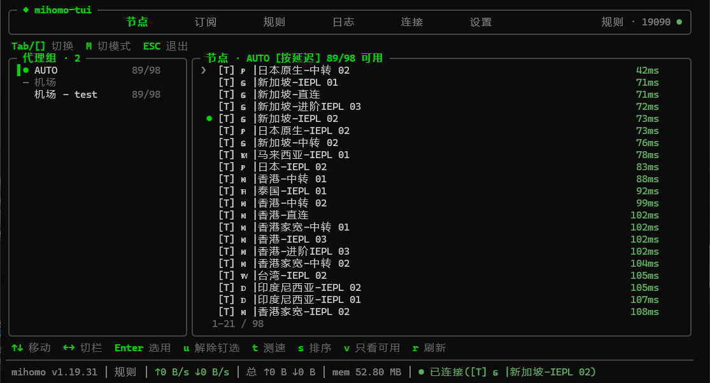
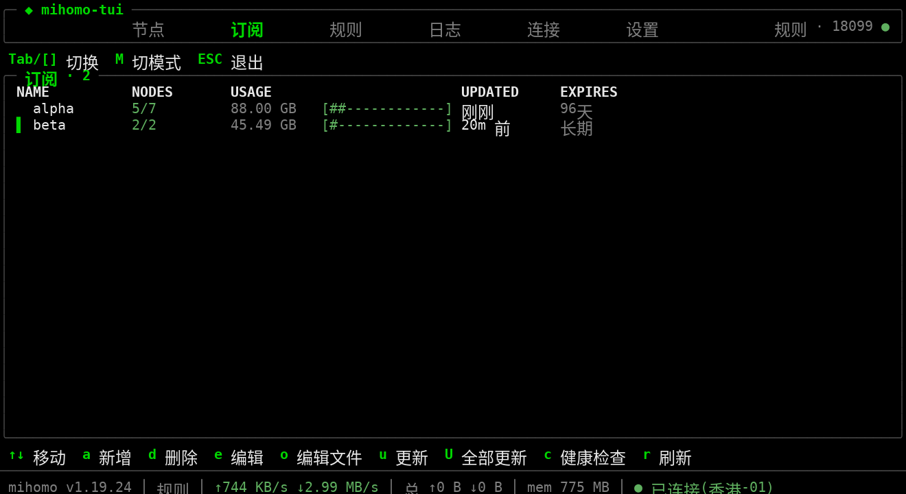
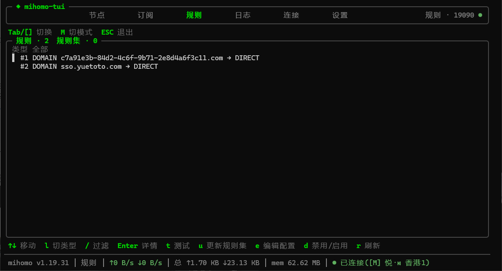

# mihomo-tui

[mihomo](https://wiki.metacubex.one/)（Clash.Meta）内核的 CLI + TUI 管理工具。切节点、
管订阅、编辑规则、看实时日志与连接，全部通过本机 External Controller 的 REST API 完成，
订阅更新不覆盖你手写的 `config.yaml`。

[安装](#安装) · [第一次使用](#第一次使用) · [CLI 速查](#cli-速查) · [反馈问题](https://github.com/MrChen-hero/mihomo-tui/issues)


它没有后端、账号和遥测。程序配置与订阅清单保存在 `~/.config/mihomo-tui/`，内核配置在
mihomo 目录，全部数据只落本机。

> 适合在本机长期运行 mihomo、希望订阅更新不冲掉自定义配置的用户。README 截图由虚构数据生成。

## 页面一览

| 节点页：代理组与节点，延迟五档显示 | 订阅页：节点数、流量与到期 |
| --- | --- |
|  |  |

| 规则页：生效规则与规则集 | |
| --- | --- |
|  | |

## 能做什么

- **TUI**：六个标签页（节点 / 订阅 / 规则 / 日志 / 连接 / 设置），数字键直达、`ESC` 逐层返回、`M` 切换规则 / 全局 / 直连。
- **节点**：切换代理组与节点，单节点与整组测速，延迟五档显示并严格区分「未测试」与「超时」，只看可用；url-test / fallback 组的钉选解除走 CLI。
- **订阅**：TUI 内新增、删除、编辑订阅，展示节点数、流量与到期时间；更新走 API，内核不重启、连接不断。
- **规则**：筛选生效规则、保守测试域名与 IP 命中、运行时临时禁用；内置规则编辑器直接修改本地 `config.yaml` 规则段（保留原注释，保存前独立校验 + 备份）。
- **监控**：WebSocket 日志流（级别切换、关键字过滤）与连接流（排序、关闭），状态栏常驻内核版本、模式、速率、流量、内存。
- **CLI**：脚本与管道友好的全量子命令，支持 `--json` 供 `jq` 消费。

## 数据与隐私

- 数据全部在本机：程序配置 `~/.config/mihomo-tui/config.json`，订阅清单
  `~/.config/mihomo-tui/subscriptions.json`（权限 `600`，**含订阅 token**），内核配置在
  mihomo 目录（默认 `~/.config/mihomo`）。
- 联网只有四类：本机 External Controller；你配置的订阅与规则集 URL；设置页查询内核版本
  时访问 `api.github.com` 并从 [MetaCubeX/mihomo Releases](https://github.com/MetaCubeX/mihomo/releases)
  下载（可选 `gh-proxy.com` 镜像）；延迟测试访问你配置的测速地址。
- 订阅 token 在所有 TUI / CLI 展示、日志与错误信息中经 `redactUrl` 脱敏为 `<REDACTED>`。
- 所有写 `config.yaml` 的路径统一走「备份 → `mihomo -t` 校验 → 原子写入 → 失败自动回滚」，
  备份 `config.yaml.bak.*` 保留 7 天。
- Release 产物附 `checksums.txt`（SHA256）；macOS 首次运行被 Gatekeeper 拦截时执行
  `xattr -d com.apple.quarantine mihomo-tui-*`。

不要把真实订阅链接或 token 提交到 Git 仓库。许可证见 LICENSE。

## 本地运行

Node.js ≥ 22（依赖内置 `fetch` 与全局 `WebSocket`，不引入 ws / undici / axios），外加一台
运行中且配置了 `external-controller` 的 mihomo 内核。

```bash
git clone https://github.com/MrChen-hero/mihomo-tui.git
cd mihomo-tui
npm install        # 仓库不提交 lockfile，不用 npm ci
```

常用命令：

```bash
npm run dev -- status   # tsx 直跑源码
npm run typecheck       # tsc --noEmit
npm test                # vitest 全量测试
npm run coverage        # 覆盖率报告
npm run build           # 编译到 dist/
npm run bundle:all      # 五平台单二进制（需 bun）
```

## 安装

### npm

```bash
npm install -g @morndream/mihomo-tui@latest
```

### 单二进制（免 Node.js）

从 [Releases](https://github.com/MrChen-hero/mihomo-tui/releases) 下载对应平台产物。国内网络直连
GitHub 缓慢时，在下载 URL 前加镜像前缀 `https://gh-proxy.com/`（Release 页已附各文件的镜像链接）：

| 平台 | 产物 |
| --- | --- |
| Linux x64 / arm64 | `mihomo-tui-*-linux-x64` / `mihomo-tui-*-linux-arm64` |
| macOS x64（Intel）/ arm64（Apple Silicon） | `mihomo-tui-*-darwin-x64` / `mihomo-tui-*-darwin-arm64` |
| Windows x64 | `mihomo-tui-*-windows-x64.exe` |

```bash
grep linux-x64 checksums.txt | sha256sum -c -   # checksums.txt 含全部五个平台，按平台过滤后校验
chmod +x mihomo-tui-*-linux-x64
```

### 发布机制

推送 `v*` tag 触发 [.github/workflows/release.yml](.github/workflows/release.yml)：五平台
交叉编译、三平台冒烟、Release 附加产物与 npm 同步发布；`-rc` 后缀的 tag 自动标记预发布并
发布到 npm 的 `next` dist-tag。项目未提供 Docker 或云平台部署配置。

## 第一次使用

1. **还没有 mihomo 内核？** 一条命令自助闭环：

   ```bash
   mihomo-tui kernel install     # 下载安装最新稳定版内核 + 生成最小引导配置
   mihomo-tui kernel service install   # 可选：一键开机自启（systemd/launchd/计划任务）
   ```

   官方源失败自动回退镜像（可 `--mirror` 指定、`--port` 自定义控制口端口）；`config.yaml`
   已存在时绝不触碰。已有内核的用户跳过本步。
2. `mihomo-tui status` 确认内核可达，输出内核版本、模式、端口与 provider 概览；连不上时
   检查内核是否已启动（安装但未启动的场景报错会单独提示）、`external-controller` 地址与
   `secret` 是否正确。
3. `~/.config/mihomo-tui/config.json` 首次运行自动生成，确认 `api`、`secret` 与
   `mihomoDir`（订阅事务和规则编辑器写 `config.yaml` 的位置）指向你的内核。
4. 进入 TUI（直接运行 `mihomo-tui`），在订阅页按 `a` 新增订阅；已有「整份订阅」旧配置的
   用户可用 `node scripts/migrate-config.mjs --dry-run --diff` 预览改造方案，确认后 `--apply`。
5. 节点页 `Enter` 选用节点、`t` 测速；订阅页 `u` 更新当前订阅、`U` 全部更新。
6. 要用 `proxy on` / `proxy off` / `proxy status` 快捷命令管理本 shell 的系统代理环境变量，
   把集成装进 bashrc（首次运行 `mihomo-tui` 时命令行也会输出同样提示）：

   ```bash
   echo 'eval "$(mihomo-tui proxy init)"' >> ~/.bashrc && source ~/.bashrc
   proxy on        # 开启本 shell 的系统代理，端口自动发现
   ```
7. 备份与迁移：配置变更自动留 `config.yaml.bak.*`（保留 7 天）；换设备时拷贝
   `~/.config/mihomo-tui/` 与 mihomo 目录即可完整复原。
8. 注意：新增 / 删除订阅会重启一次 mihomo 服务（秒级断流，更新不断流）；切节点、切模式等
   运行时改动重启后丢失，需持久化的变更写入 `config.yaml` 后执行 `mihomo-tui reload`。

## CLI 速查

```bash
mihomo-tui status                        # 内核版本、模式、端口、provider 概览
mihomo-tui proxy ls [组名]               # 代理组与节点、延迟、状态
mihomo-tui proxy use <组> <节点>         # 切换节点（url-test 组会钉选并提示）
mihomo-tui proxy unfix <组>              # 解除 url-test/fallback 组的钉选
mihomo-tui proxy test 香港 -t 5000       # 整组延迟测试
mihomo-tui provider ls                   # 订阅列表（节点数/流量/到期/更新时间）
mihomo-tui provider update [名称]        # 更新订阅，省略名称则全部
mihomo-tui rules ls --type DOMAIN-SUFFIX --json
mihomo-tui rules test example.com --json # hit / miss / unsupported
mihomo-tui logs -f                       # 实时日志跟随
mihomo-tui conn ls -s traffic -n 50      # 连接列表，按流量排序
mihomo-tui conn close <id|--all>         # 关闭连接
mihomo-tui kernel ls                     # 本地与远端内核版本
mihomo-tui kernel install [version]      # 下载安装内核与引导配置（--port/--mirror/--alpha）
mihomo-tui kernel service install        # 一键开机自启并启动内核（uninstall 卸载）
mihomo-tui reload                        # 热重载配置（内核不重启）
```

组名含中文与 emoji 直接传入即可。退出码：`0` 成功、`1` 通用错误、`2` 参数错误、`3` 内核不可达。

## 项目结构

```txt
src/
├── api/          # REST 客户端 + WebSocket 流封装
├── commands/     # CLI 子命令
├── config/       # 订阅清单、配置事务（唯一写配置入口）、规则编辑服务
├── rules/        # 规则类型转换、保守匹配与运行时禁用确认
├── kernel/       # 内核版本查询、下载与安装（含镜像源）
├── views/        # TUI 六个标签页
├── components/   # 对话框、列表、延迟徽章、状态栏
├── hooks/        # useProxies / useProviders / useStream
├── ui/           # 主题（唯一取色处）、布局、按键捕获与退出保护
├── App.tsx       # TUI 根组件
├── cli.tsx       # CLI / TUI 路由
└── version.ts    # 版本号来源链（编译期注入 → 环境变量 → package.json）
bin/mihomo-tui    # 可执行胶水：优先 dist/cli.js，未编译时回退 tsx
scripts/          # 迁移、冒烟与打包脚本
docs/             # 设计规格、路线图与开发文档
```

架构与实测背景见 [docs/SPEC.md](docs/SPEC.md)，开发文档见 [docs/DEVELOPMENT.md](docs/DEVELOPMENT.md)。

## 开发与贡献

提交修改前执行：

```bash
npm run typecheck
npm test
npm run build
git diff --check
```

写路径（订阅事务、规则编辑）与 CLI 输出契约的变更需要补测试；测试一律使用假内核与
`HOME` 重定向，不触碰真实配置目录。不要提交真实订阅数据、token、备份文件或构建产物。

设计红线与贡献步骤见 [CONTRIBUTING.md](CONTRIBUTING.md)；安全问题提交 Issue 并在标题
注明 `security`，描述中不要附真实 token 或订阅地址。

## 已知限制

- Windows 仅提供 x64 二进制；macOS 提供 x64 与 arm64；Linux 提供 x64 与 arm64。
- Node.js 全局 `WebSocket` 自 v22.4 起脱离实验状态，更早的小版本（22.0–22.3）未验证。
- 切节点、切模式、临时禁用规则等运行时改动重启内核后不保留。
- 规则编辑器不支持写入锚点、别名与顶层合并来源；保守规则测试遇到 `GEOIP`、`RULE-SET`
  等会提示「需内核判定」，命中结果只表示规则目标，不代表真实流量路径。
- 不支持 SSH 隧道、容器路径映射等非本机回环场景。
- mihomo 内核不回应 WebSocket close 帧，用过日志 / 连接流的命令都显式退出。

## 许可证

本项目使用 [MIT License](LICENSE)。
